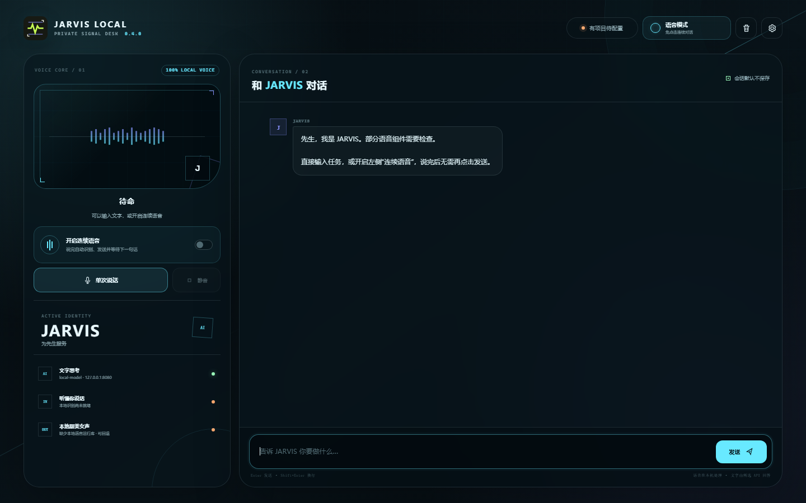
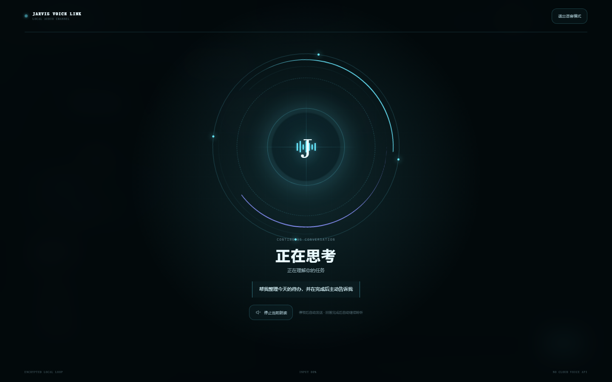

# JARVIS LOCAL

JARVIS LOCAL 是一个独立编写、本地优先的私人语音助手。产品外壳名称固定为 **JARVIS LOCAL**，应用中的智能体名字、主人称呼和性格可以随时修改。

当前 `0.4.0` 版本已经形成完整的本地双向语音闭环，并重新整理了交互层：

- 默认用 `sherpa-onnx + Kokoro` 在 CPU 上离线合成中文/英文语音，预设“晓晓 · 甜美女声”；
- 同一模型内置晓晓、晓妮、晓伊、晓北四种女生音色，可在保存前直接试听；
- 使用 `faster-whisper` 完成本机录音识别，支持 CPU、CUDA 和自动设备选择；
- 新增免点击“连续语音”：自动监听、检测说话结束、识别并发送，回答播完后继续监听；
- 可选任务完成主动播报；普通模式只提示完成，连续语音模式可直接读出完整回答；
- 新增原生透明矢量 HUD 悬浮助手：没有黑色方框、边框或底板，玻璃光弧与中央声纹会随语音状态实时变化；启动时完整显示，拖动到边缘松开后才会吸边收起 80%，悬停展开，点击时临时置顶；
- 提供贾维斯蓝、星云紫、矩阵绿、反应堆金四套配色；主面板使用 Windows 整窗透明度，支持在 30%–96% 之间即时预览，悬浮窗透明度可以单独调节；
- 仍支持单次录音、试听、停止朗读、最长录音限制，以及“识别后确认/自动发送”两种模式；
- 本地语音不可用时可明确回退到 Windows/浏览器系统语音；
- 保留 MeloTTS 与系统语音兼容模式；外部 TTS 仅是可选扩展，不是运行条件；
- 直接连接 `llama.cpp` 或任意 OpenAI-compatible 模型接口，不依赖 Ollama；
- API 密钥进入操作系统凭据库，不写入 `settings.json`；
- 默认不保存会话正文，HTTP 服务只监听本机回环地址。

界面、信号标识、交互状态动画和源代码均在本项目中独立创作，没有复制恢复目录中的 UI、图标、提示词或程序代码。详细边界见 [ORIGINALITY.md](ORIGINALITY.md) 和 [CLEAN_ROOM.md](CLEAN_ROOM.md)。



连续语音模式会显示独立的环形状态界面，明确区分“正在聆听、正在识别、正在思考、正在回答”。语音识别与甜美女声均在本机完成，日常使用只需配置一个文本模型 API；Ollama 和语音模型 API 都不是必需项。



## 推荐环境

- 64 位 Windows 10/11；
- Python 3.11 或 3.12；
- 至少 4 GB 可用内存；使用 `faster-whisper small` 时建议 8 GB 以上；
- 首次安装依赖和模型需要联网，模型准备完毕后本地语音可离线运行。

当前多数本地 AI/语音依赖尚未完整支持 Python 3.14，请不要用 3.14 创建运行环境。

## 1. 建立基础环境

在 PowerShell 中进入项目目录后执行：

```powershell
powershell -ExecutionPolicy Bypass -File .\scripts\setup_windows.ps1
```

完成后双击 `start_jarvis.cmd`，或执行桌面窗口：

```powershell
.\.venv\Scripts\python.exe .\desktop.py
```

只使用浏览器窗口时执行：

```powershell
.\.venv\Scripts\python.exe .\run.py
```

## 2. 安装本地双向语音

执行：

```powershell
powershell -ExecutionPolicy Bypass -File .\scripts\install_voice.ps1
```

脚本会先安装语音运行依赖，然后分别询问是否下载：

- `kokoro-multi-lang-v1_0`：约 334 MiB，用于 sherpa-onnx 多音色离线合成；
- `faster-whisper small`：约 500 MB，用于本机语音识别。

直接确认两个模型时可使用：

```powershell
powershell -ExecutionPolicy Bypass -File .\scripts\install_voice.ps1 -DownloadModels
```

安装器从上游官方发布地址获取 Kokoro 模型，并在安装前验证 `model.onnx`、`voices.bin`、中英文词典、`tokens.txt` 和随模型提供的 `LICENSE`。已有但不完整的模型目录不会被覆盖。

默认模型目录：

```text
%LOCALAPPDATA%\JarvisAssistant\models\tts\kokoro-multi-lang-v1_0
```

如果设置了 `JARVIS_DATA_DIR`，模型和配置都会使用该目录。也可以在“设置 → 语音合成”中指定其他合法模型目录。

安装完成后重新启动应用，打开设置并点击“试听当前声音”。左侧状态会区分“缺少 sherpa 包”和“缺少模型”，方便定位问题。

## 语音设置说明

### 默认合成：Sherpa + Kokoro 多女声

- 完全在本机 CPU 运行；
- 默认音色为 `zf_xiaoxiao`，说话人编号 `47`；
- 可选 `zf_xiaoni`（46）、`zf_xiaoyi`（48）和 `zf_xiaobei`（45）；
- `CPU 线程数` 默认为 `2`，一般可设为物理核心数的一半；
- 支持 `0.5–2.0` 倍语速；
- 模型只加载一次，修改语音设置后会安全清除并重建缓存。

音色选择只是设置说话人编号，所有音频仍由本机模型生成，不会调用语音 API。试听按钮读取当前表单，因此可以依次比较四种音色，再保存喜欢的选择。如果本地模型尚未安装，试听会明确提示安装，而不会用系统语音伪装成目标音色。

“甜美、元气、温柔、清亮”是为了方便试听比较而提供的主观风格标签，不是模型上游给出的客观分类；不同设备和语速下听感会有差异，以本机试听结果为准。

### 本机识别：faster-whisper

- 默认模型 `small`、设备 `cpu`、计算类型 `int8`；
- 有 NVIDIA CUDA 环境时可在设置中切换到 `cuda`；
- 默认最长录音 45 秒，可在 5–120 秒之间调整；
- 默认先把识别文字放入输入框，确认后再发送；需要免手动确认时可启用“识别后直接发送”。

录音只提交给当前 JARVIS LOCAL 的本机 `/api/stt` 接口。临时音频在识别后立即删除，不写入会话历史。

### 可选 Python Kokoro 兼容模式

默认模式已经通过 sherpa-onnx 使用 Kokoro，无需再安装 Python Kokoro 包。只有兼容旧设置或调试上游 Python 管线时，才需要单独执行：

```powershell
powershell -ExecutionPolicy Bypass -File .\scripts\install_kokoro.ps1
```

然后在设置中选择 `Kokoro Python` 并填写音色名。该模式不是日常使用所必需。

### 外部高质量语音

可以把 CosyVoice 等项目运行在独立环境中，再提供一个接受下列 OpenAI-compatible 请求的端点：

```json
{
  "model": "tts-1",
  "voice": "default",
  "input": "要朗读的文字",
  "speed": 1.0,
  "response_format": "wav"
}
```

响应必须使用 `audio/*` Content-Type，并直接返回音频字节。独立进程可避免高质量语音项目的 CUDA/Python 依赖污染主程序。

## 3. 连接智能核心（无需 Ollama）

准备一个来源和许可证均合法的 GGUF 模型，用 `llama.cpp` 启动本机服务：

```powershell
llama-server.exe -m D:\Models\your-model.gguf --host 127.0.0.1 --port 8080 -c 8192
```

在 JARVIS LOCAL 设置中填写：

- 接口模式：`OpenAI-compatible`
- 接口地址：`http://127.0.0.1:8080/v1`
- 模型名称：`local-model`
- API 密钥：本机无鉴权服务可留空

也可以连接其他兼容服务。在线服务的密钥会交给 Windows 凭据管理器；也可仅为当前账户设置 `JARVIS_API_KEY` 环境变量。

## 隐私与安全

- 会话仅存在于当前窗口内存，关闭后消失；
- 配置位于 `%LOCALAPPDATA%\JarvisAssistant\settings.json`；
- 模型 API 密钥不进入配置文件或浏览器 bootstrap 数据；
- 服务只允许绑定 `127.0.0.1`、`localhost` 或 `::1`；
- 请求校验 Host 和 Origin，并设置严格 CSP；
- 日志只记录路径和状态，不记录聊天正文或录音内容；
- 外部 TTS 响应限制为 20 MB，录音请求限制为 25 MB。

## 常见问题

**显示“需安装 sherpa-onnx”**  
重新运行 `scripts\install_voice.ps1`，确认使用的是项目 `.venv`。

**显示“需安装本地语音模型”**  
重新运行安装脚本并同意 Kokoro 模型下载，或在设置中选择实际模型目录。默认目录必须包含 ONNX 模型、`voices.bin`、词典和 `tokens.txt`。

**麦克风按钮不可用**  
确认 faster-whisper 已安装、Windows 已授予应用麦克风权限，并且语音识别没有在设置中关闭。

**本地 TTS 失败但仍然发声**  
这是启用了“允许系统语音回退”。若要暴露本地引擎错误用于排查，可临时关闭该选项再试听。

## 开发检查

```powershell
.\.venv\Scripts\python.exe -m unittest discover -s tests -v
node --check .\jarvis\static\app.js
```

第三方组件和模型说明见 [THIRD_PARTY_NOTICES.md](THIRD_PARTY_NOTICES.md)。公开发布或商业化前，请生成锁定依赖清单、随安装包附上实际许可证文本，并为产品选择可注册的独特品牌；“JARVIS”与知名影视角色存在较强关联，应用内的可配置助手名与正式商标是两件不同的事。
